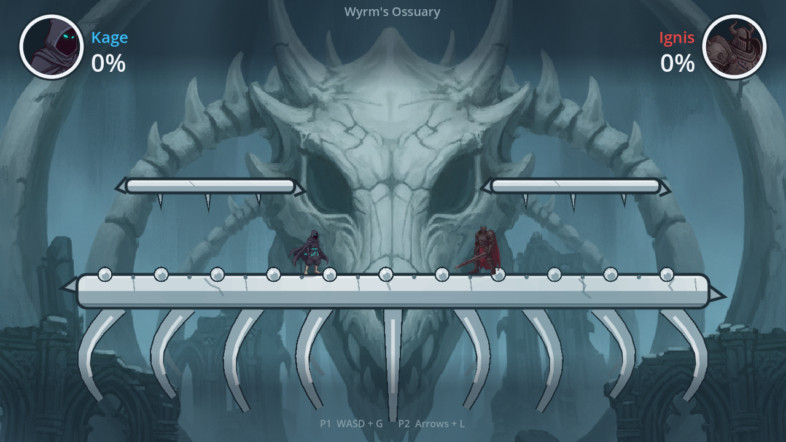
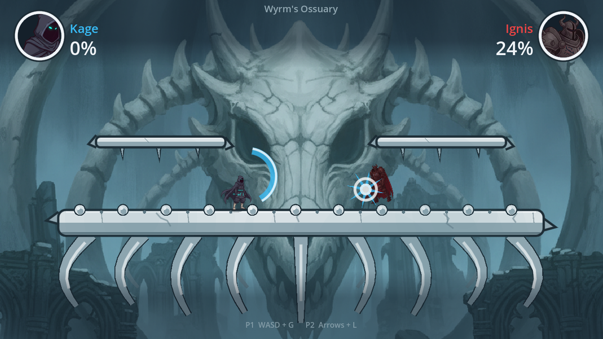
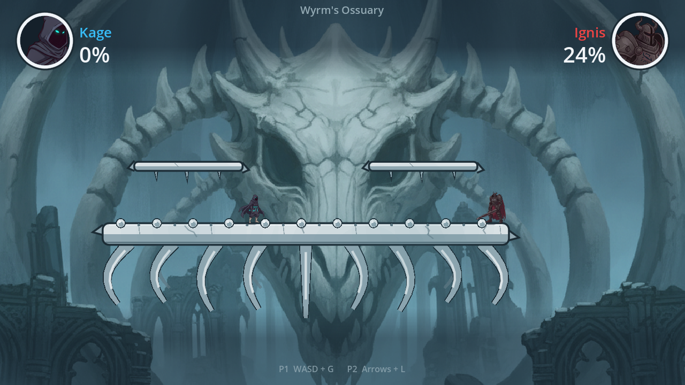

# BrawlCrypt

A local-multiplayer 2D gothic platform fighter built in **Godot 4.4+** (GDScript, GL
Compatibility renderer). Two fighters brawl on the spine of a dead dragon in the
**Wyrm's Ossuary**: damage percentages, knockback that grows with damage, hitstop, a camera
that frames both players, and a medallion HUD. The genre is inspired by games like
Brawlhalla; all names, art and code here are original.

Local multiplayer only: there is no online play and none is planned.





## Open and run

1. Install [Godot 4.4 or newer](https://godotengine.org/download) (the standard build; no
   .NET needed).
2. In the Project Manager choose **Import**, select this folder's `project.godot`, then **Edit**.
3. Press **F5** (Run Project). `scenes/Main.tscn` is the main scene.

Or from a terminal, with `GODOT` pointing at your Godot binary:

```bash
GODOT=/path/to/godot      # e.g. ~/Downloads/Godot_v4.4.1-stable_linux.x86_64
$GODOT --path .            # run the main scene
$GODOT --path . --editor   # open the editor
```

## Controls

| Action | Player 1 (keyboard) | Player 1 (joypad 0) | Player 2 (keyboard) | Player 2 (joypad 1) |
| ------ | ------------------- | ------------------- | ------------------- | ------------------- |
| Left   | A                   | Left stick / D-pad  | Left arrow          | Left stick / D-pad  |
| Right  | D                   | Left stick / D-pad  | Right arrow         | Left stick / D-pad  |
| Jump   | W                   | A (bottom face)     | Up arrow            | A (bottom face)     |
| Down / fast-fall | S         | Left stick / D-pad down | Down arrow      | Left stick / D-pad down |
| Attack | G                   | X (left face)       | L                   | X (left face)       |

Bindings live in `project.godot` under `[input]` as actions `p1_left`, `p1_right`, `p1_jump`,
`p1_down`, `p1_attack` and the matching `p2_*` set. Scripts only ever read those actions
(`"p%d_%s" % [player_index, name]`), so rebinding in **Project > Project Settings > Input Map**
needs no code changes. Joypad bindings are per device: device 0 drives P1, device 1 drives P2.

## Roster and stage

| Slot     | Fighter   | Colour             | Sprite                      |
| -------- | --------- | ------------------ | --------------------------- |
| Player 1 | **Kage**  | cyan `#38bdf8`     | `assets/sprites/kage.png`, 64 px tall  |
| Player 2 | **Ignis** | crimson `#ef4444`  | `assets/sprites/ignis.png`, 72 px tall |

Stage: **Wyrm's Ossuary**. The main platform is a dragon's spine with a ribcage hanging
under it, the two one-way platforms are floating bone shards, and a painted dragon skull,
ruins and mist sit behind it all. The palette (`scripts/brawl_theme.gd`, `BrawlTheme`) is
bone white over teal-grey shadows; damage read-outs go white, yellow (35%), orange (75%), red
(120%).

## Folder layout

```
project.godot            settings, input map, physics layers, display
scenes/Main.tscn         the arena: backdrop layer, StageArt, Mist, floor + two shards,
                         Player1/Player2, Vfx, fight camera, vignette, medallion HUD
scripts/main.gd          wiring: camera targets, backdrop parallax, fighter signals -> Vfx/shake
scripts/player.gd        fighter movement, fast-fall, air friction, jump buffer, attack,
                         percentage / take_damage(), knockback state, hitstop, respawn
scripts/hitbox.gd        Area2D attack hitbox (one hit per activation, hits resolved at tick end)
scripts/fighter_visual.gd sprite feel: idle bob, run lean, air stretch, landing squash, shadow
scripts/fight_camera.gd  two-target camera: midpoint framing, distance zoom, shake
scripts/stage_art.gd     procedural bone spine, ribs and shards (static _draw)
scripts/mist.gd          drifting translucent mist blobs
scripts/vfx.gd           hit sparks, slash arcs, landing dust (frame-counted, world space)
scripts/hud.gd           medallion HUD: percentage labels and ring colours
scripts/medallion_ring.gd coloured ring around each portrait
scripts/brawl_theme.gd   palette constants, player_color(), percent_color()
prefabs/Player.tscn      CharacterBody2D + Sprite2D + CollisionShape2D + Hitbox (Area2D)
prefabs/Platform.tscn    one-way StaticBody2D platform, 240x20 (no visual; StageArt draws it)
assets/art-src/          generated sources: ossuary_far_1280x720.png, kage_magenta_1024.png,
                         ignis_magenta_1024.png
assets/backdrops/        ossuary_far.png (the painted backdrop) + .import sidecar
assets/sprites/          kage.png, ignis.png, kage_portrait.png, ignis_portrait.png + sidecars
tools/process_art.gd     art pipeline: art-src -> backdrops + sprites + portraits
tools/screenshot.gd      captures docs/screenshot-*.png from Main.tscn under Xvfb
tests/                   headless test runner (run_tests.gd), TestContext, test_*.gd suites
docs/                    review screenshots (docs/screenshot-*.png); .gdignore keeps Godot
                         from importing them as textures
```

Physics layers: 1 `world` (floor, platforms), 2 `players`, 3 `hitboxes`. Player bodies are on
layer 2 and collide only with layer 1, so fighters pass through each other. Hitboxes are on
layer 3 and scan layer 2.

## Art pipeline

The three images in `assets/art-src/` were generated with Google's Gemini image model from the
author's AI Studio account: the backdrop as a finished 1280x720 painting, each fighter as a
full-body sprite facing right on a flat magenta background. `tools/process_art.gd` turns them
into game assets:

- `assets/backdrops/ossuary_far.png`: a copy of the backdrop.
- `assets/sprites/kage.png`, `ignis.png`: the magenta is chroma-keyed (alpha ramps from 0 to 1
  as a pixel's RGB distance from the sampled background colour goes from 70 to 130; any other
  magenta-hued pixel, such as the ground shadow under Ignis, is cut too), edge pixels are
  despilled from their opaque neighbours, the sprite is cropped to its used rect plus a 2 px
  margin and Lanczos-resized to 64 px (Kage) or 72 px (Ignis) tall. Both face right.
- `assets/sprites/kage_portrait.png`, `ignis_portrait.png`: 96x96 medallions cut from the head
  band of the keyed sprite, clipped to a circle of radius 46 and filled with slate.

To regenerate after replacing a source image:

```bash
$GODOT --headless --path . --script tools/process_art.gd   # writes the PNGs, prints each size
$GODOT --headless --path . --import                         # refreshes the .import sidecars
```

The sidecars are committed, so a fresh clone needs no editor pass before running the tests.

## Tunables

Every physics and feel constant is an `@export`, editable per instance in the Inspector. Units:
px, px/s, px/s², physics frames at 60 Hz.

`scripts/player.gd`:

| Export                        | Default | Unit     | Meaning |
| ----------------------------- | ------- | -------- | ------- |
| `run_speed`                   | 340.0   | px/s     | horizontal top speed from input |
| `ground_acceleration`         | 2600.0  | px/s²    | toward target speed while grounded |
| `ground_friction`             | 2400.0  | px/s²    | toward zero while grounded, no input |
| `air_acceleration`            | 1300.0  | px/s²    | toward target speed while airborne |
| `air_friction`                | 320.0   | px/s²    | toward zero while airborne, no input (slight resistance) |
| `gravity`                     | 1500.0  | px/s²    | downward acceleration while airborne |
| `max_fall_speed`              | 900.0   | px/s     | normal terminal velocity |
| `fast_fall_gravity_multiplier`| 2.5     | ×        | gravity multiplier while holding down in the air, once no longer rising |
| `fast_fall_max_speed`         | 1500.0  | px/s     | terminal velocity while fast-falling |
| `jump_velocity`               | -620.0  | px/s     | initial vertical speed of a jump (up is negative) |
| `jump_buffer_frames`          | 6       | frames   | a jump pressed this many frames before landing still fires |
| `attack_startup_frames`       | 3       | frames   | frames before the hitbox turns on |
| `attack_active_frames`        | 6       | frames   | frames the hitbox is on |
| `attack_recovery_frames`      | 10      | frames   | frames after the hitbox before another attack |
| `attack_damage`               | 8.0     | %        | percentage added per hit |
| `attack_base_knockback`       | 260.0   | px/s     | base knockback of the attack; actual = base × (victim percentage / 10) |
| `knockback_stun_frames`       | 20      | frames   | frames a hit fighter is in the knockback state (no control) |
| `hitstop_frames`              | 5       | frames   | frames both fighters freeze when a hitbox connects |
| `respawn_below_y`             | 1200.0  | px       | falling past this y respawns the fighter at 0% |

`scripts/fight_camera.gd` (on `Main/Camera2D`):

| Export        | Default | Meaning |
| ------------- | ------- | ------- |
| `min_zoom`    | 0.72    | widest view (Camera2D zoom; smaller = further out) |
| `max_zoom`    | 1.15    | tightest view when the fighters are close |
| `lerp_factor` | 0.08    | per-frame fraction the position and zoom move toward their targets |
| `y_offset`    | -40.0   | frames the midpoint this many px above the fighters |

Target zoom is `clamp(700 / (distance + 300), min_zoom, max_zoom)`; the camera limits
`(-200, -240)..(1480, 960)` keep the view on the stage.

## Tests and static checks

Everything runs headlessly with the same Godot binary you play with. From the repository root,
with `GODOT` set to your binary:

```bash
GODOT=/path/to/godot

# (Re)import assets. Required after adding or changing PNG files. Prints nothing when clean.
$GODOT --headless --path . --import 2>&1 | grep -iE "error"

# Parse + static-check one script (exit 0, no "SCRIPT ERROR" lines).
$GODOT --headless --path . --check-only --script scripts/player.gd

# Full test suite. Last line is "==== N passed, M failed ===="; exit code 1 on any failure.
$GODOT --headless --path . --fixed-fps 60 --script tests/run_tests.gd 2>&1 | grep -vE "^(Godot Engine|$)"

# Lint + formatting (pip install gdtoolkit). "gdformat <files>" rewrites in place.
gdlint scripts tests tools && gdformat --check scripts tests tools

# Run Main.tscn for 2 s with software rendering (Linux, needs xvfb). Must print nothing.
LIBGL_ALWAYS_SOFTWARE=1 xvfb-run -a -s "-screen 0 1280x720x24" $GODOT --path . \
  --rendering-driver opengl3 --audio-driver Dummy --quit-after 120 2>&1 | grep -iE "script error|^error"

# Refresh docs/screenshot-main.png, docs/screenshot-hit.png and docs/screenshot-zoom.png.
LIBGL_ALWAYS_SOFTWARE=1 xvfb-run -a -s "-screen 0 1280x720x24" $GODOT --path . \
  --rendering-driver opengl3 --audio-driver Dummy --script tools/screenshot.gd
```

Tests are plain GDScript: `tests/run_tests.gd` discovers `tests/test_*.gd`, instantiates each
suite and awaits every `test_*(ctx: TestContext)` method. `TestContext` spawns players and
floors, presses InputMap actions, steps physics frames and records `check`/`check_near`
assertions. Expected values are hand-derived from the tunables above (dt = 1/60), so a change to
a default fails the test that encodes it. `tests/test_art_assets.gd` checks the pipeline
outputs (sizes, keyed corners, circular portraits); `tests/test_scenes.gd` checks the arena
layers, HUD tree and camera; `tests/test_vfx_hud.gd` checks effect lifetimes and the HUD.

## What is implemented / next steps

Implemented:

- Two players on one keyboard or on two joypads, through the `p1_*` / `p2_*` InputMap actions.
- Platform-fighter movement: run with separate ground and air acceleration, ground friction,
  air friction, gravity with a terminal velocity, fast-falling (never cuts a jump short) and
  jump buffering.
- One attack per player with startup / active / recovery frames and an Area2D hitbox that
  hits each opponent once per swing; same-frame trades hit both fighters.
- Combat: `percentage`, `take_damage(base_knockback, direction[, damage_amount])`, knockback
  `base × (percentage / 10)` away from the attacker with upward lift, a knockback stun state,
  and **hitstop**: both fighters freeze for `hitstop_frames` when a hitbox connects.
- A respawn when a fighter falls off the bottom.
- Presentation: the Wyrm's Ossuary (painted skull backdrop with parallax, procedural bone
  spine and ribs, floating shards, drifting mist, vignette), Kage and Ignis sprites with idle
  bob / run lean / air stretch / landing squash, a two-target fight camera with distance zoom
  and hit shake, slash arcs, hit sparks and landing dust, and a medallion HUD with portraits,
  names and colour-coded percentages.

Not yet:

- Stocks and blast-zone KOs on the sides and top, round flow, win screen.
- Dodge / dash, double jump, wall slide, ledge grab.
- Weapons and more than one attack per fighter.
- More fighters (Zephyr is next) and a Veo-animated backdrop for the ossuary.
- Sound, menus and a controls screen.
